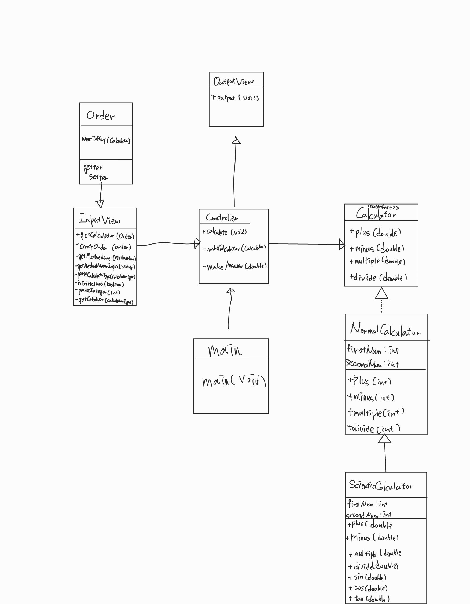

# **계산기를 선택하고 간단한 계산을 해보자** 

2차상속 개념을 적용한 미니 프로젝트 CLI 과제입니다.<br>

## 클래스 다이어그램



## 프로그램 설명
* CLI 기반의 간단한 계산기 프로그램
* Calculator라는 인터페이스에서 상속받는 일반계산기와 일반계산기를 다시 상속받는 공학용계산기를 구현했습니다.
* how it works?
  * 유저는 첫 입력에서 일반계산기, 공학용계산기 중 하나를 선택할 수 있습니다.
  * 어떤 계산기인지에 따라 선택할 수 있는 연산이 출력되고, 유저는 그 중 하나를 선택합니다.
  * 사칙연산의 경우 정수 2개를 입력하고, 삼각함수 계산의 경우 정수 하나를 입력합니다.
  * 정수 입력까지 완료되면 결과값이 나오고 프로그램은 종료됩니다.

## 입출력 예시
* 첫 입력
  * ```
    원하는 계산기를 입력하세요(일반계산기, 공학용계산기 둘 중 하나를 입력하세요):
    ```
  * 입력이 올바른 경우 연산 선택 입력으로 넘어감
  * 만약 입력이 올바르지 않다면 경고문과 함께 다시 선택할 수 있는 입력란이 출력됨
    * ```
      잘못된 입력입니다. 일반계산기 또는 공학용계산기를 입력하시기 바랍니다.
      원하는 계산기를 입력하세요(일반계산기, 공학용계산기 둘 중 하나를 입력하세요):
      ```
    
* 연산 입력
  * 일반계산기를 입력할 경우 아래 문구가 나오고 연산 입력 가능
    * ```
      어떤 연산을 하고 싶습니까?
      가능한 연산
      * 더하기
      * 빼기
      * 곱하기
      * 나누기
      ```
  * 공학용계산기를 입력할 경우 아래 문구가 나오고 연산 입력 가능
    * ```
      어떤 연산을 하고 싶습니까?
      가능한 연산
      * 더하기
      * 빼기
      * 곱하기
      * 나누기
      * 사인(입력단위 : degree)
      * 코사인(입력단위 : degree)
      * 탄젠트(입력단위 : degree)
      ```
  * 목록 외 잘못된 입력을 할 경우 경고문구와 함께 다시 입력란이 출력됨
    * ```
      잘못된 입력입니다. 목록의 연산 이름을 정확하게 입력하세요.(예 : 더하기)
      어떤 연산을 하고 싶습니까?
      ...............(연산목록 출력)
      ```
* 정수 입력
  * 사칙연산의 경우 정수 2개, 삼각함수의 경우 정수 하나를 입력함
  * 사칙연산을 선택한 경우 
    * ```
      첫번째 정수를 입력하세요 : 
      두번째 정수를 입력하세요 : 
      ```
  * 삼각함수를 선택한 경우
    * ```
      정수를 한 개 입력하세요 :
      ```
* 결과 출력
  * 연산 결과를 다음과 같이 출력함
    * ```
      계산된 결과입니다. : 
      ```
      
* TDD
  * InputView와 OutputView, 일반계산기와 공학용계산기에 대한 테스트코드를 작성했습니다.
  * 모든 테스트코드는 public method에 한해 진행되었습니다.
